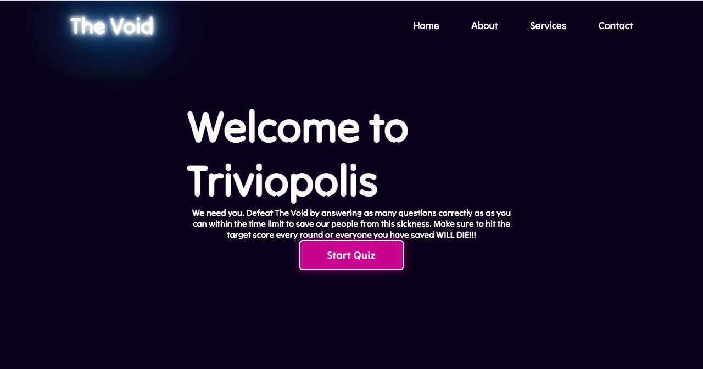
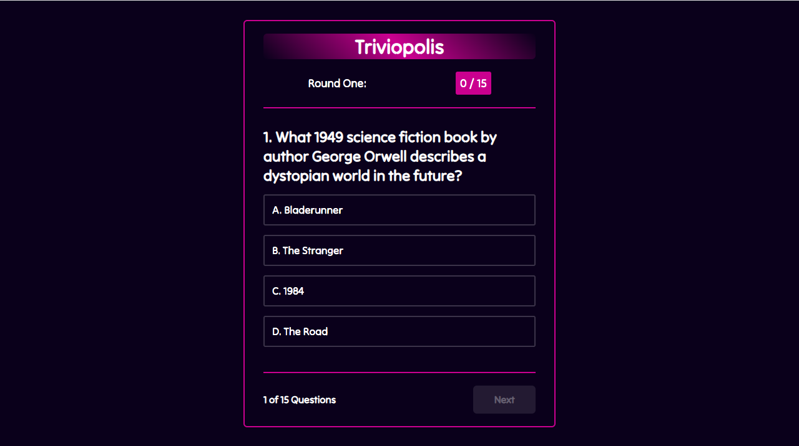
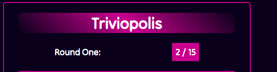
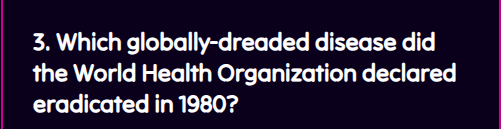
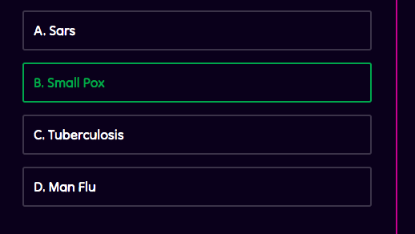
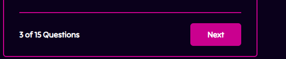
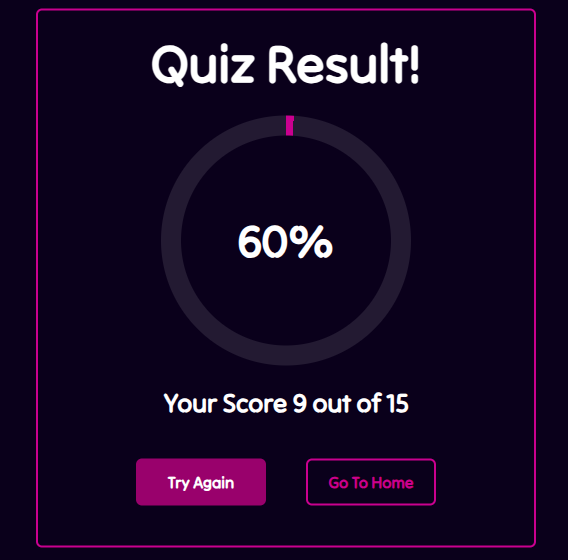
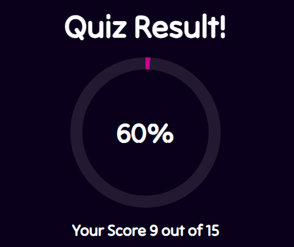
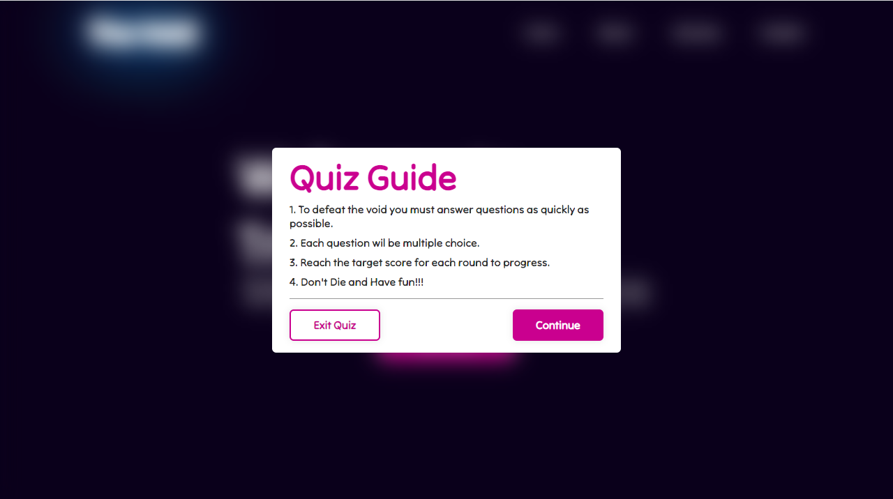

# Triviopolis Quiz App

Welcome to Triviopolis, an interactive quiz application where players must answer questions to defeat The Void and save the world. This repository contains the HTML, CSS, and JavaScript code for the Triviopolis Quiz App.



## Table of Contents

- [Getting Started](#getting-started)
- [Features](#features)
- [Usage](#usage)
- [Quiz Guide](#quiz-guide)
- [Contributing](#contributing)
- [License](#license)
- [Script Overview](#script-overview)
- [Event Handlers](#event-handlers)
- [Functions](#functions)

## Getting Started

To get started with Triviopolis, follow these steps:

1. Clone the repository: `git clone [repository-url]`
2. Open the `index.html` file in a web browser.

## Features

- **Interactive Quiz:** Answer multiple-choice questions to progress through the game.
- **Scoring:** Track your score and aim to reach the target score for each round.
- **Result Display:** View your quiz result, percentage, and overall score.
- **Try Again:** Restart the quiz to improve your score.
- **Navigation:** Easily navigate between home, quiz, and result sections.


## Usage

1. **Home Section:**
   - Read the introductory message.
   - Click the "Start Quiz" button to begin.
   - pop up info box


2. **Quiz Section:**
   - Answer each multiple-choice question.
   - Use the "Next" button to proceed to the next question.







3. **Result Section:**
   - View your quiz result, percentage, and overall score.
   - Choose to try the quiz again or return to the home page.





## Quiz Guide

1. **To defeat the void:**
   - Answer questions as quickly as possible.
2. **Each question:**
   - Multiple-choice format.
3. **Target Score:**
   - Reach the target score for each round to progress.
4. **Enjoy the Game:**
   - Have fun, and remember not to let everyone die!


# Triviopolis Quiz App - JavaScript Script

The `script.js` file contains the JavaScript logic for the Triviopolis Quiz App. This script manages the interactive features, user interactions, and the progression of the quiz. Below is a brief README to help you understand the structure and functionality of the script.

## Script Overview

The JavaScript script (`script.js`) is responsible for handling the dynamic behavior of the Triviopolis Quiz App. It manipulates the DOM to show and hide various sections of the app, updates scores, displays questions, and handles user interactions.

## Event Handlers

### 1. Start Button Event

The script handles the click event on the start button, displaying the initial popup and activating the main section of the quiz.

```javascript
startBtn.onclick = () => {
    popupInfo.classList.add('active');
    main.classList.add('active');
}
```

### 2. Exit Event Button
The script handles the click event on the exit button, removing the popup and deactivating the main section.
```
exitBtn.onclick = () => {
    popupInfo.classList.remove('active');
    main.classList.remove('active');
}
```
### Continue Button Event
When the user clicks the continue button, the script activates the quiz section, hides the popup, and sets up the initial quiz state.
```
continueBtn.onclick = () => {
    quizSection.classList.add('active');
    popupInfo.classList.remove('active');
    main.classList.remove('active');
    quizBox.classList.add('active');

    showQuestions(0);
    questionCounter(1);
    headerScore();

}
```
### Try Again Button Event
The try again button resets the quiz to its initial state, allowing the user to retake the quiz.
```
tryAgainBtn.onclick = () => {
    quizBox.classList.add('active');
    nextBtn.classList.remove('active');
    resultBox.classList.remove('active');

    questionCount = 0;
    questionNumb = 1;
    userScore = 0;

    showQuestions(questionCount);
    questionCounter(questionNumb);

    headerScore();

}
```
### 5. Go Home Button Event
Clicking the go home button takes the user back to the home section, resetting the quiz state.
```
goHomeBtn.onclick = () => {
    quizSection.classList.remove('active');
    nextBtn.classList.remove('active');
    resultBox.classList.remove('active');

    questionCount = 0;
    questionNumb = 1;
    userScore = 0;

    showQuestions(questionCount);
    questionCounter(questionNumb);

    headerScore();

}
```
### 6. Next Button Event
The next button event handles the progression of the quiz, showing the next question or displaying the result if the last question is reached.
```
nextBtn.onclick = () => {
    if (questionCount < questions.length - 1) {
    questionCount++;
    showQuestions(questionCount);

    questionNumb++;
    questionCounter(questionNumb);

    nextBtn.classList.remove('active');
    }
    else {
        showResultBox();
    }
}
```

## Functions

### 1. showQuestions(index)
This function updates the displayed question and options based on the provided index.
```
function showQuestions(index) {
    const questionText = document.querySelector('.question-text');
    questionText.textContent = `${questions[index].numb}. ${questions[index].question}`;

    let optionTag = `<div class="option"><span>${questions[index].options[0]}</span></div>
        <div class="option"><span>${questions[index].options[1]}</span></div>
        <div class="option"><span>${questions[index].options[2]}</span></div>
        <div class="option"><span>${questions[index].options[3]}</span></div>`;

    optionList.innerHTML = optionTag;

    const option = document.querySelectorAll('.option');
    for (let i = 0; i < option.length; i++) {
        option[i].setAttribute('onclick', 'optionSelected(this)');
    }
}
```
### 2. optionSelected(answer)
Handles the user's selection of an option, checks if it's correct, and updates the UI accordingly.
```
function optionSelected(answer) {
    let userAnswer = answer.textContent;
    let correctAnswer = questions[questionCount].answer;
    let allOptions = optionList.children.length;
    console.log(correctAnswer);
    if (userAnswer == correctAnswer) {
        answer.classList.add('correct');
        userScore += 1;
        headerScore();
    }
    else {
        answer.classList.add('incorrect');

        //if answer is incorrect, auto select correct answer //
        for (let i = 0; i < allOptions; i++) {
            if (optionList.children[i].textContent == correctAnswer)
                optionList.children[i].setAttribute('class', 'option correct');
        }
    }

    //if user has selected. All options are disabled //
    for (let i = 0; i < allOptions; i++) {
        optionList.children[i].classList.add('disabled');
    }

    nextBtn.classList.add('active');
}
```
### 3. questionCounter(index)
Updates the UI to show the current question number out of the total number of questions.
```
function questionCounter(index) {
    const questionTotal = document.querySelector('.question-total');
    questionTotal.textContent = `${index} of ${questions.length} Questions`;
}
```
### 4. headerScore()
Updates the UI to display the user's current score.
```
function headerScore () {
    const headerScoreText = document.querySelector('.header-score');
    headerScoreText.textContent =`${userScore} / ${questions.length}`;
}
```
### 5. showResultBox()
Handles the transition to the result box, displaying the final score and a circular progress animation.
```
function showResultBox() {
    quizBox.classList.remove('active');
    resultBox.classList.add('active');

    const scoreText = document.querySelector('.score-text');
    scoreText.textContent = `Your Score ${userScore} out of ${questions.length}`;

    const circularProgress = document.querySelector('.circular-progress');
    const progressValue = document.querySelector('.progress-value');
    let progressStartValue = -1;
    let progressEndValue = (userScore / questions.length) * 100;
    let speed = 20;

    let progress = setInterval(() => {
        progressStartValue++;
    
        progressValue.textContent = `${progressStartValue}%`;
        circularProgress.style.background = `conic-gradient(#c40094 ${progressStartValue * 3.6}deg, rgba(255, 255, 255, .1) 0deg)`;
        
        if (progressStartValue >= progressEndValue) {
            clearInterval(progress);
        }
    }, speed);
}
```
## Questions.js

This section contains the array of questions used in the Triviopolis Quiz App. The `questions` array is an essential part of the application, providing the content for the quiz.

## Questions Array

The `questions` array is an array of objects, where each object represents a quiz question. Each question object has the following properties:

- `numb`: A numerical identifier for the question.
- `question`: The text of the question.
- `answer`: The correct answer to the question.
- `options`: An array of multiple-choice options for the question.

Here is an example of a question object:

```javascript
{
  numb: 1,
  question: "What 1949 science fiction book by author George Orwell describes a dystopian world in the future?",
  answer: "C. 1984",
  options: [
    "A. Bladerunner", 
    "B. The Stranger", 
    "C. 1984", 
    "D. The Road"
  ]
}
```

# Testing

## Event Handlers

### Start Button
Start button triggers the pop up info box to display correctly. CSS styling responds as it should. Tests Successful.

### Continue  Button
Continue button initializes the quiz section to display and quiz to start. CSS styling responds as expected. Test successful.

### Answer options
Answer options respond as expected when clicked. Green highlight around correct answers and red highlight around incorrect answers. CSS styling responds as expected. Test Successful.

### Next Button

Next button changes to the next sequential question and answer options in the questions array. CSS styling responds as expected. Test successful. 

### Exit Button

Exit button exits the quiz and returns the user to the landing page once more. CSS styling and JS respond as expected. Test Successful. 

## Functions 

### showQuestions(index):

Responds as expected.  
Test successful.

### optionSelected(answer):

Responds as expected
Test successful. 

### questionCounter(index):

Responds as expected.
Test successful.

### headerScore():

Responds as expected.
Test Successful.

### showResultBox()

Responds as expected. 
Test Successful.

## Known Issues

### Background image on Landing Page:

Background image does not display on deployed website link however works just fine on browser server when triggered from the terminal. 
This will be fixed in future update.

### Hover styles on Nav:

Hover styles on Nav bar on landing page do not respond to hover and active css styling.
This will be fixed in future update. 

##Credit 

This project was heavily influenced by a project by Codehal on YouTube and can be found here (https://www.youtube.com/watch?v=Vp8x8-reqZA&t=304s)

# Conclusion 

The provided README offers an overview of the essential components in the Triviopolis Quiz App, focusing on the JavaScript script and the array of questions. By understanding the structure of the JavaScript code and the format of the questions array, developers can seamlessly integrate and customize the quiz application.

As you embark on using or modifying this codebase, consider the following:

Customization: Tailor the questions array to suit the specific theme or subject of your quiz. You can expand the array, modify questions, or add new categories to enhance user engagement.

User Experience: Keep the user experience in mind while making changes. Ensure that the flow of questions, visual elements, and interaction patterns align with the desired user journey.

Documentation: Update the README as needed, providing comprehensive documentation for future developers or collaborators who might work on the project.

Feel free to explore additional features, design improvements, or integrations to enhance the Triviopolis Quiz App. Happy coding!


## Contributing

Contributions are welcome! If you find a bug or have an enhancement in mind, feel free to open an issue or submit a pull request.

Thank you for using Triviopolis! Enjoy the quiz and help save the world from The Void!

